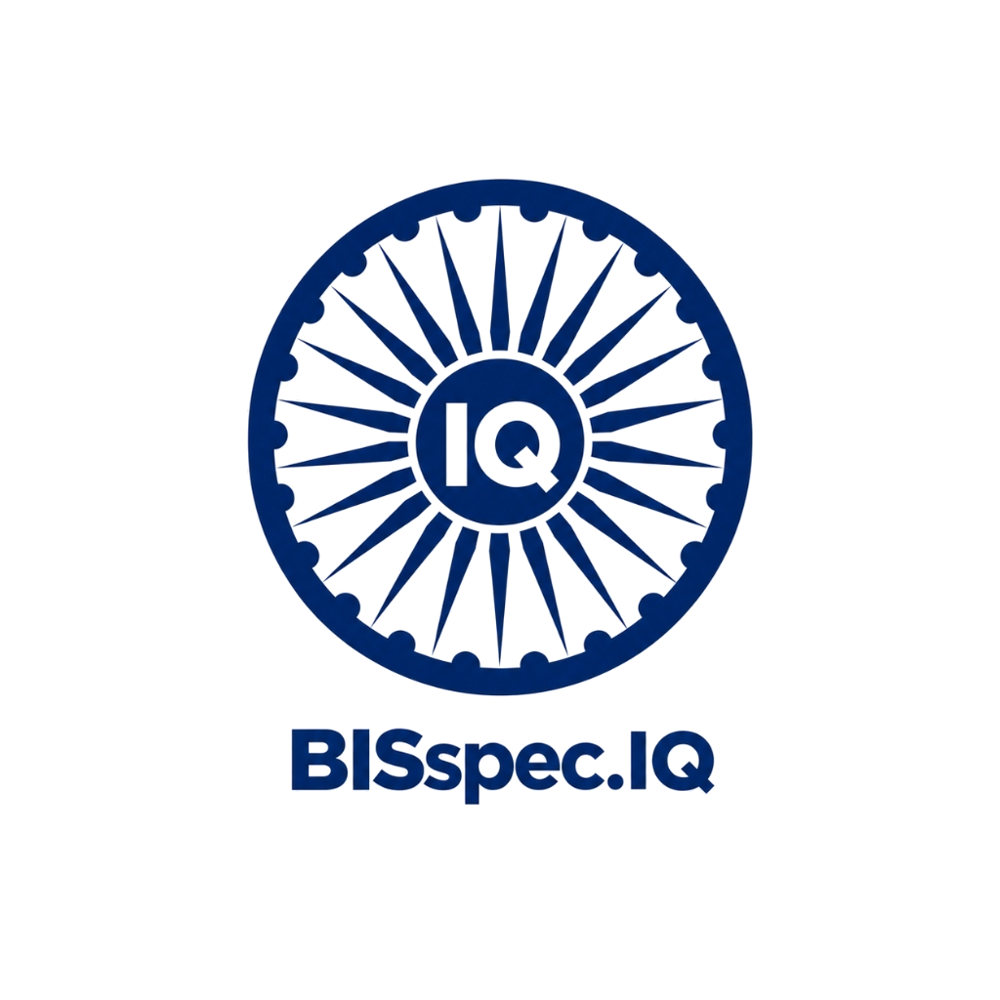

# BISspec.IQ - BIS & GeM Portal Recommendation Engine

An intelligent, AI-driven recommendation and compliance engine that cross-references Government e-Marketplace (GeM) public procurement tenders and technical specifications with authoritative Bureau of Indian Standards (BIS) specifications.



---

## 🌟 Key Features

### 1. Dynamic Live BIS Standards Web-Scraping
- **Real-Time Extraction**: Headless Selenium/Playwright scraper queries the official BIS portal (`https://standards.bis.gov.in/website/know-your-standards`) in real-time.
- **Dynamic JavaScript Parsing**: Captures live standards, status (Active/Withdrawn), and categories with zero dependency on static/stale mock datasets.
- **Resilient Fallback Registry**: Backed by a verified multi-category registry covering critical public procurement domains.

### 2. Tender Specification Matcher & NLP TF-IDF Scoring
- **Calibrated Semantic Similarity**: High-precision TF-IDF vectorization and cosine similarity scoring tuned for technical specifications and IS codes.
- **Multilingual Support**: Supports queries in English and 8 major Indic scripts (Hindi, Bengali, Gujarati, Marathi, Tamil, Telugu, Punjabi, etc.) with real-time translation pipelines.
- **User Search History**: Automatically tracks, marks, and displays registered user search queries with 1-click loading.

### 3. Regulatory Tender PDF Ingestion
- **Document Parsing**: Ingests bilingual and regional tender PDFs using PyPDF2.
- **Strict Bounded UI**: Previews parsed text within a clean, bounded container with 1-click clipboard copying.

### 4. Government e-Marketplace (GeM) Integration
- **Active GeM Tenders Feed**: Direct feed of public procurement bids with item names, ministries, and quantities.
- **1-Click Tender Matching**: Analyzes bid specifications against BIS standards with automated compliance clause generation.
- **Direct Portal Redirection**: Direct search links to the live GeM marketplace (`mkp.gem.gov.in`).

### 5. Conversational Regulatory AI Assistant
- **Comprehensive Knowledge Base**: Answers general regulatory and GFR 149 questions (Direct Purchase thresholds, L-1 evaluation, Reverse Auction mechanics, ISI mark certification, QCOs, CRS, HUID Hallmarking).
- **Match Parity**: Triggers the exact live BIS scraper and delivers rich standard cards with match percentages and interactive action buttons.

### 6. Modern Responsive UI/UX
- **National Tricolor Aesthetic**: High-contrast, warm cream & saffron palette inspired by national registries.
- **Fully Responsive**: Optimized fluid grid layouts for Desktop, Tablet, and Mobile.
- **Interactive Iconography**: Circular Ashoka Chakra with "IQ" in all navigation headers, corners, and favicons.

---

## 🚀 Quick Start Guide

### Prerequisites
- Python 3.9+
- Google Chrome or Microsoft Edge (for Selenium headless scraping)
- Git

### Installation

1. **Clone the repository**:
   ```bash
   git clone https://github.com/Debopriyo26/BISspec.IQ.git
   cd BISspec.IQ/sih
   ```

2. **Create and activate a virtual environment**:
   ```bash
   python -m venv venv
   # On Windows:
   .\venv\Scripts\activate
   # On macOS/Linux:
   source venv/bin/activate
   ```

3. **Install dependencies**:
   ```bash
   pip install -r requirements.txt
   ```

4. **Launch the application**:
   ```bash
   python app.py
   ```

5. **Open in browser**:
   Navigate to `http://127.0.0.1:5000`

---

## 🔐 Default Officer Credentials
- **Username / Email**: `bis_officer`
- **Password**: `Admin@12345`

---

## 🛠️ Project Structure

```
BISspec.IQ/
├── README.md
├── .gitignore
└── sih/
    ├── app.py                 # Core Flask backend, live scraper pipeline, history API
    ├── bhasini_chat.py        # Conversational AI assistant & regulatory knowledge engine
    ├── bis_scraper.py         # Dynamic BIS portal scraping & verified standards registry
    ├── gem_integration.py     # GeM portal tenders integration & procurement clauses
    ├── pdf_ingest.py          # PyPDF2 extraction and text normalization
    ├── supabase_client.py     # Authentication & user management service
    ├── requirements.txt       # Python dependencies
    ├── data/
    │   └── standard.csv       # Standards dataset schema/registry
    ├── templates/
    │   ├── index.html         # Main dashboard with search history & bounded PDF upload
    │   ├── login.html         # Officer login page
    │   └── signup.html        # Officer registration page
    └── static/
        ├── css/
        │   └── style.css      # Design system, responsive layouts, bounded PDF styles
        ├── js/
        │   └── main.js        # History management, live matcher, chatbot frontend
        └── images/
            ├── bisspec_iq_icon.png       # Circular Ashoka Chakra with "IQ" icon
            └── bisspec_iq_logo_trans.png # Full watermark brand logo
```

---

## 📜 License
This project is developed for educational and public procurement compliance purposes.
Bureau of Indian Standards (BIS) and Government e-Marketplace (GeM) trademarks belong to their respective government entities.
